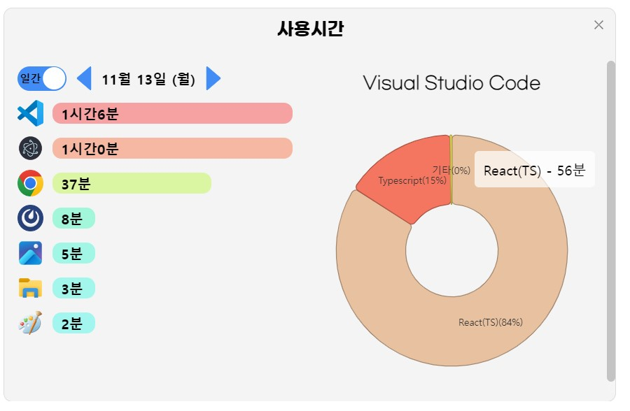
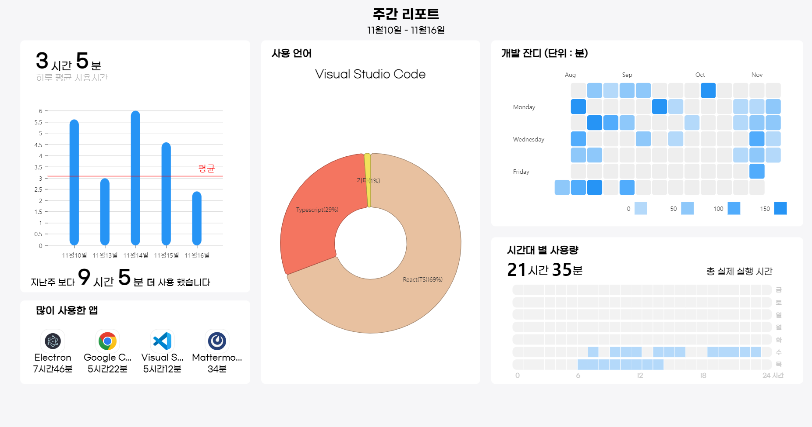
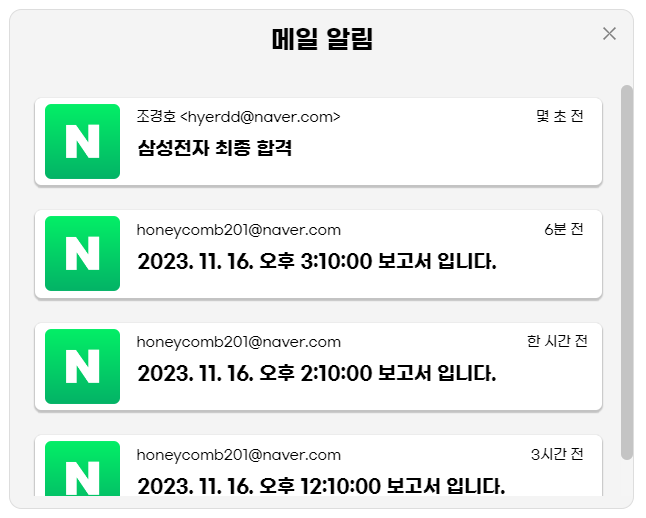
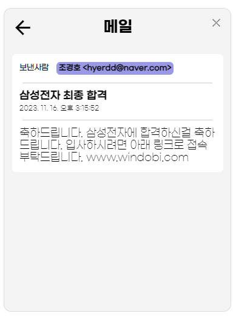
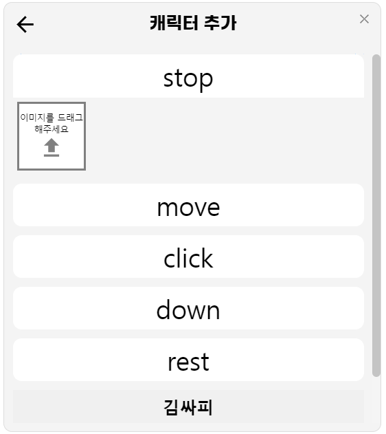
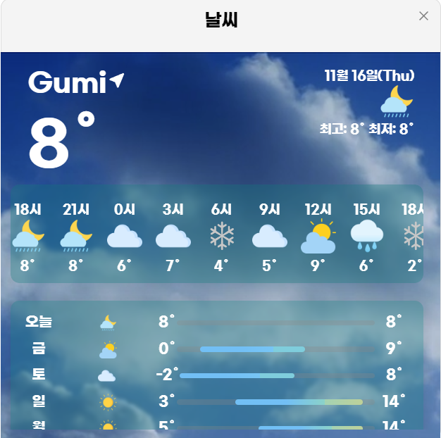

# Windobi
윈도비(windobi)는 데스크탑에서 기동되는 어플리케이션입니다
 - 별도의 백엔드 없이 로컬에서 기동
 - windows에서 기동 확인, mac 및 linux에서의 기동 확인 필요

## 기술
 - Electron
 - React
 - SQLite
 - OpenAI API
 - OpenWeather API

## 사용시간 분석 및 보고서
### 사용시간

### 주간보고서

## 메일
### 메일 도착 알림

### 받은 메일 리스트

### 메일 확인

## 플레이리스트 생성
### 생성된 플레이 리스트

## 캐릭터 커스텀
### 캐릭터 추가

### 캐릭터 변경

## 날씨
### 날씨

